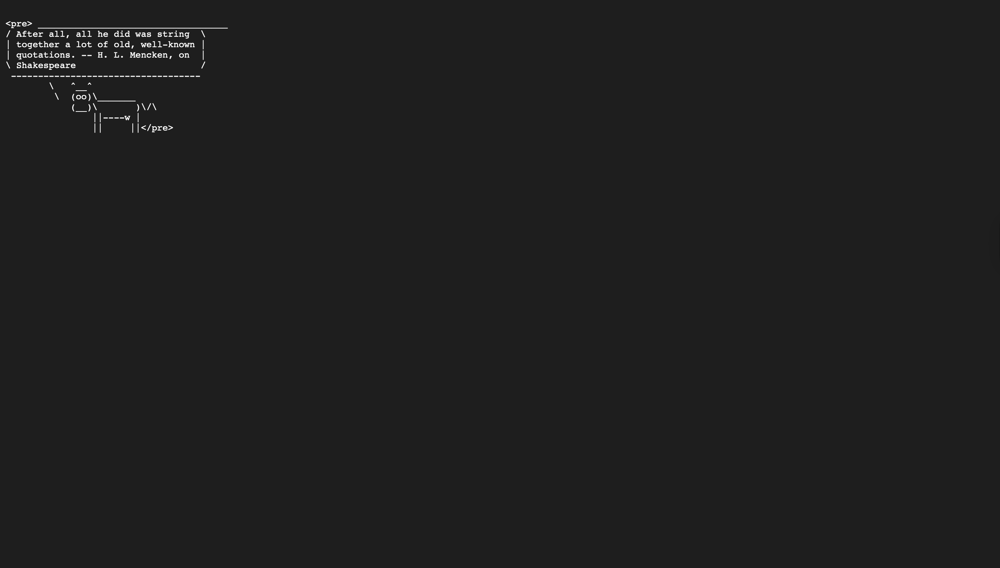
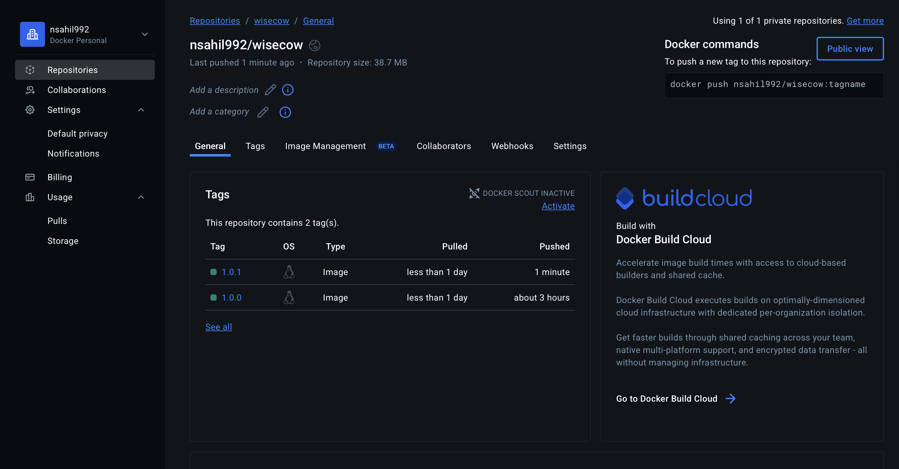
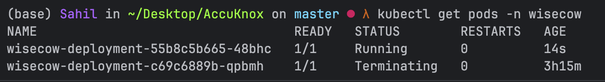
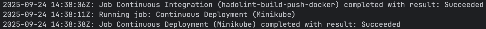

# Wisecow – AccuKnox Problem Statement Project

## Overview



**Wisecow** is a fun Kubernetes-deployed script that serves random fortunes in the terminal using `cowsay`. This project demonstrates **containerization, Kubernetes deployment, and CI/CD automation** in a production-like environment.  

The goal of this project was to complete the AccuKnox Problem Statement by:

1. Containerizing the Wisecow application with Docker.
2. Deploying it on **Minikube** in a dedicated namespace.
3. Exposing it via Kubernetes **Service**.
4. Automating CI/CD pipelines with **GitHub Actions**.
5. Building scripts using bash for analyzing log files and checking health of application.

---

## Project Structure

```
.
├── Dockerfile                  # Docker image definition for Wisecow
├── Makefile                    # Build, run, push commands for Docker
├── wisecow.sh                  # Bash application serving fortunes
├── Kubernetes/
│   ├── wisecow-deployment.yaml # Kubernetes Deployment manifest
│   ├── wisecow-service.yaml    # Kubernetes Service manifest
├── Problem-Statement2/
│   ├── AppHealthCheck.sh       # Check health of the application
│   └── LogAnalyze.sh           # Analyze logs of the web server
├── .github/workflows/
│   ├──cicd.yaml                # CICD automation
├── .dockerignore               # exclude files from getting containerized
├── .gitignore                  # exclude irrelevant files from getting pushed to GitHub
└── README.md
```

## Steps Completed

### 1. Dockerization

- Created a **multi-stage Dockerfile** to reduce image size.
- Installed dependencies (`cowsay`, `fortune-mod`, `netcat-openbsd`) in the container.
- Used base image pinning for consistency
- Ensured the application is executable and exposed the correct port.

### 2. Kubernetes Deployment

- Created a **namespace** `wisecow`.
- Defined a **Deployment** manifest:
  - 1 replica
  - Resource limits for CPU and memory
  - Container port 4499
- Defined a **Service** (NodePort) for internal access.

### 3. CI/CD Pipeline

- Linted Dockerfile using hadolint.
- Automated Docker build, run, and push to DockerHub via Makefile.
- Implemented GitHub Actions workflow to:
  ```
    Checkout code
    Validate Dockerfile
    Build Docker image
    Push to DockerHub
    Apply Kubernetes manifests to Minikube
  ```

  
  
  

  ---

  # Problem Statement 2 – App Health Check & Log Analyzer

1. **Application Health Check**  
   - Verifies whether a web application is up and running.  
   - Prints HTTP status code and application uptime.  

2. **Web Server Log Analyzer**  
   - Parses web server logs to extract useful insights such as:  
     - Number of requests served  
     - Top IP addresses accessing the application  
     - Most requested endpoints  
     - Error rate analysis (e.g., 4xx / 5xx errors)

Together, these tools help monitor application availability and performance.  

---


